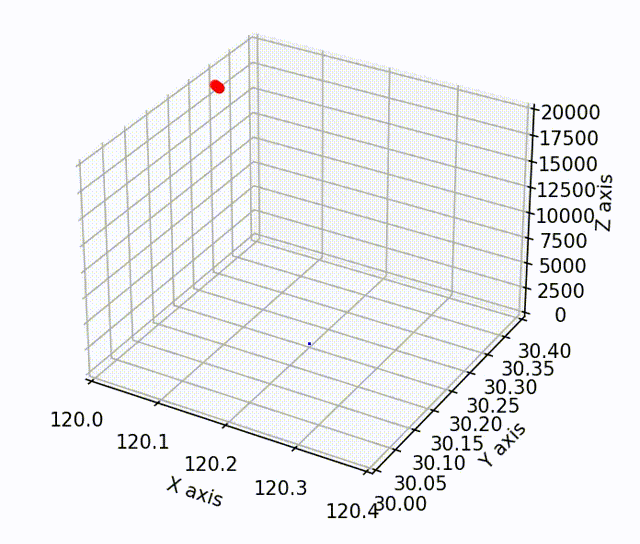
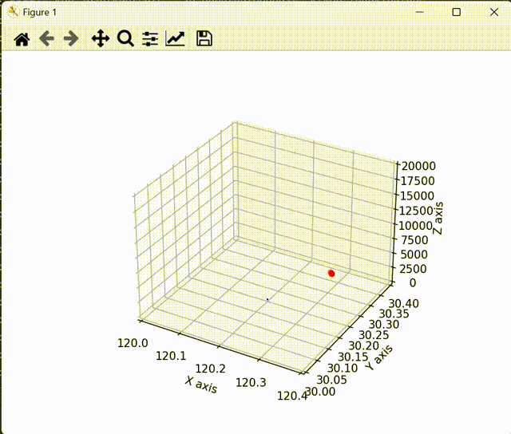
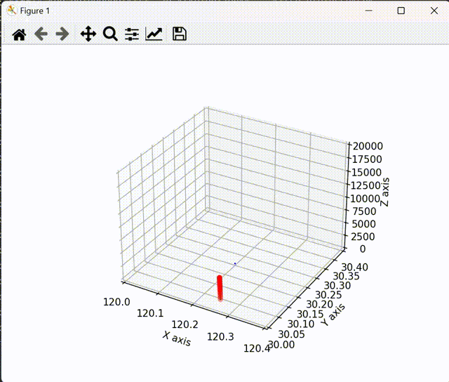
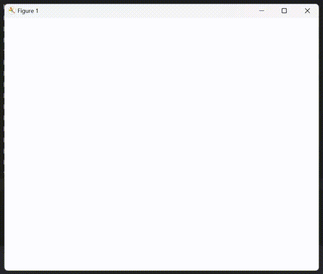

# 比例制导拦截弹道仿真模型

本项目完成了贴近现实的拦截弹拦截目标弹时的产生的拦截轨迹，仿真内容包含如下方面：

1)开发了一个估计目标轨迹，并多弹发射拦截目标的拦截弹道仿真模型。

2)通过比例制导法，追击补偿，速度限制，转角限制等约束条件，优化拦截弹道轨迹。

3)输出GPS坐标的仿真结果存储日志。

## 使用方法

### 1.依赖库
	yaml-cpp
	eigen3.4.0

### 2.复制文件

    将simulation.cpp, obejection.cpp, hitter.cpp, utils.cpp和对应的.h头文件复制到目标代码目录中

### 3.文件路径配置
    - 将simulation.cpp中的PATH宏定义修改为实际的yaml存放路径
    - 修改config.yaml文件中的simulator:OUTPUT_TRAJECTION_PATH项，修改为实际的输出文件路径

### 4.编译器设置
    配置c++标准为 ISO C++ 17 标准

### 5.根据实际使用修改config文件
    根据下文参数说明的使用方法根据实际修改config文件，也可采用默认参数运行

### 6.引入代码

项目将函数进行了封装，可在需要使用的项目文件中添加#include "simulation.h"引入simulation.h文件，通过missile_sim()函数，即可调用

示例：

    #include "simulation.h"

    int main() {
	    missile_sim();
	    return 0;
    }

## 参数配置
simulator:

    MAX_SIM_SIZE:
        可配置数值为一个浮点数数，设置最大仿真范围。

    STEP_SIZE:
        可配置数值为一个浮点数，设置仿真的时间步长。

    INITIAL_LOC:
        可配置数值为3个元素的浮点列表，配置原点位置的经纬度坐标。

    COORDINATE:
        可配置选项为 "GPS" 或 "cartesian",可配置输出的日志文件坐标为GPS坐标或三维笛卡尔坐标。

    OUTPUT_TRAJECTION_PATH:
        可配置输出文件的路径。

interceptor:
 
    DELAY_TIME
        可设置选项为"random"或整数值，设置目标导弹发射后，拦截弹延迟发射的时间

    DELAY_TIME_RANDOM_RANG
        如DELAY_TIME设置为random，则该配置生效。可设置为两个元素的列表，最大随机范围不超过MAX_SIM_SIZE。

    SEARING_TIME:
        可配置数值为浮点数。配置导弹搜索目标的延迟时间。

    NUM_INTERCEPTOR:
        可配置数值为整数。配置发射拦截弹的数量。
    
    INITIAL_POSITION:
        可配置数值为三个浮点数的列表。配置距离原点的相对距离，最大范围不超过MAX_SIM_SIZE。
    
    TRACKING_MATHOD:
        可配置选项为 "proportional_guidance"或"idel"。
        proportional_guidance:比例制导发的追踪目标模式。
        idel: 理想追踪模式。

    PROPORTIONAL_GUIDANCE_P:
        如配置TRACKING_MATHOD为"proportional_guidance"时，该项配置生效。可配置值为一个浮点数，配置比例追踪法的比例系数。
    
    PROPORTIONAL_GUIDANCE_COMPENSATE:
        如配置TRACKING_MATHOD为"proportional_guidance"时，该项配置生效。可配置值为一个浮点数，配置比例制导法的追击补偿系数。

    SPEED_LIMIT:
        如配置TRACKING_MATHOD为"proportional_guidance"时，该项配置生效。可配置值为一个浮点数。配置导弹的速度限制。

    ANGLE_LIMIT:
        如配置TRACKING_MATHOD为"proportional_guidance"时，该项配置生效。可配置值为一个浮点数。配置导弹的转角限制。
    
    HIT_TOLERANCE:
        可配置值为一个浮点数。可以配置拦截弹击中目标弹的仿真击中容差。

obejection:

    MAX_RANDOM_SPEED:
        可配置值为一个浮点数，配置生成目标弹时的最大随机速度。

## 输出
- 仿真运行时，输出output_trajection.txt的坐标日志文件。
- 文件存储格式为，每行存储一个对象的信息，目标弹或拦截弹。如有多个拦截弹，则每个拦截弹，占一行储存。
- 每行存储的格式为，时间 | 对象名称 | 对象的坐标

    如下存储示例：

        3.8	hitter	120.174	30.1749	1704.49
        3.8	hitter	120.141	30.1753	170.867	
        3.8	hitter	120.232	30.1873	6203.1	
        3.8	hitter	120.194	30.1569	3010.73	
        3.8	hitter	120.178	30.1753	4703.74	
        3.8	hitter	120.215	30.2173	1456.13	
        3.8	hitter	120.231	30.1952	7061.26	
        3.8	hitter	120.16	30.2032	6365.77	
        3.8	hitter	120.164	30.218	5307.47	
        3.8	hitter	120.183	30.1455	1574.15	
        3.8	target	120.332	30.3108	12206.9	
        3.9	hitter	120.172	30.1728	1849.14	
        3.9	hitter	120.136	30.1732	185.429	
        3.9	hitter	120.237	30.1854	6731.77	
        3.9	hitter	120.195	30.1508	3267.33	
        3.9	hitter	120.176	30.1717	5104.63	
        3.9	hitter	120.215	30.2188	1578.48	
        3.9	hitter	120.234	30.1945	7663.07	
        3.9	hitter	120.155	30.2037	6908.3	
        3.9	hitter	120.161	30.2206	5759.81	
        3.9	hitter	120.181	30.1385	1707.98	
        3.9	target	120.33	30.3105	12362.5	

表示在第3.7秒和第3.8秒的存储信息，拦截弹一共发射了10颗，每行保存了拦截弹和目标的时间信息，和经纬度坐标信息。
本项目提供python日志文件可视化示例。

## python可视化代码使用说明
    将pyvisualization文件夹中的test.py中的 yamlpath和trajection_path修改为实际的config.yaml文件和trajection_path.txt文件路径之后运行即可。

## 效果展示

## 版本迭代说明

V1：

基本功能实现：

        目标弹：
            3D坐标系下目标轨迹生成，目标移动行为。

        拦截弹：
            拦截弹感知目标弹功能，保存目标弹移动轨迹
            拦截弹对目标弹预测功能，预测下一个时间片（step）目标弹位置
            拦截弹对目标弹追踪功能，实现朝向目标弹的理想追踪
            判断击中行为，设置击中容差
        可视化：
            可视化轨迹（供测试）
            3D坐标仿真可视化功能（供测试）

V1.2    

        添加多弹齐发拦截目标弹功能

V1.3    

        添加比例制导模型，采用更加贴近物理的方法实现对目标弹的拦截，可调节比例制导P参数
        增加配置文件设置，提供可配置参数，包括 初始发射坐标，发射数量等
V2.0

        增加弹道的横向载荷限制（转角约束）
        增加追击误差补偿，完善拦截弹弹道

V2.1    

        增加时间段范围内多弹随机发射拦截弹，模拟弹药填充

V2.2    

        4个方向随机发射目标弹，模拟对不同方位目标弹的拦截能力

V2.3       

        增加坐标存储日志
        优化多弹发射可视化运行逻辑，多弹可视化运行更加流畅
V3.0

        增加可视化为GPS坐标
        输出模拟仿真日志“output.txt”，存储坐标为GPS坐标，保存格式为  
        时间t    导弹类型    GPS位置坐标
